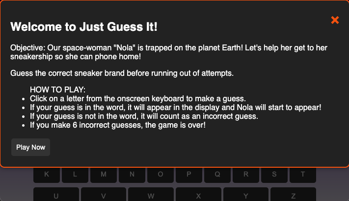

# Just Guess It! 🚀

## Overview

**Just Guess It!** is a fun, browser-based word guessing game where the objective is to help "Nola," a space-woman, get back to her spaceship by correctly guessing different sneaker brands. Each correct guess reveals part of the word, and each incorrect guess brings Nola closer to being stuck on Earth forever!

The game ends when you either guess the word correctly or make six incorrect guesses. After each successful guess, you level up and the game continues with a new word. If you guess the final word correctly, Nola finally gets to phone home!

## Screenshot

## Features

- **Word Guessing**: Guess letters to reveal the sneaker brand.
- **Scoring**: Tracks your score as you correctly guess words.  
- **Levels**: Progress through different levels by guessing multiple words.
- **Visual Feedback**: Images change based on your progress in the game.
- **Win/Loss Messages**: Special messages display when you win or lose.

## How to Play

1. **Start the Game**: Click "Play Now" to start in the instuctional screen or the 'X' to exit the instructional screen.
2. **Guess the Word**: Click on letters from the on-screen keyboard to guess the word. If your guess is correct, the letter appears in the word. If incorrect, you get closer to losing.
3. **Win or Lose**: You have six tries to guess the word. If you guess correctly, you level up and continue to the next word. If you guess all words correctly, Nola phones home, and you win!
4. **Reset the Game**: If you want to start over, click the "NEW GAME" button.

## Technology Used

- **HTML**: For structuring the game interface.
- **CSS**: For styling the game, including responsive design for different screen sizes.
- **JavaScript**: For game logic, including handling guesses, scoring, and updating the game state.
- **ChatGPT**: Used for brainstorming ideas, debugging assistance, writing explanations, AI generated images, and generating parts of the code and documentation.

## Installation

To play the game:

1. Click the link here * <https://github.com/Maj-dot/You-Guessed-It.git>
3. Enjoy the game!

## Future Improvements 

1. **Additional Levels and Word Categories**
   - Introduce new levels with different themes or categories, such as movie titles, famous cities, or other popular brands.
   - Allow players to select a category or have random categories each time they play.

2. **Multiplayer Mode**
   - Implement a multiplayer mode where two players can take turns guessing the word.
   - Add a competitive element with a scoring system to determine the winner after a set number of rounds.

3. **Hints and Power-ups**
   - Add a hint system where players can use earned points to reveal a letter or get a clue about the word.
   - Introduce power-ups that allow players to skip a difficult word or get extra guesses.

4. **Leaderboard**
   - Implement a global or local leaderboard where players can see how their scores compare to others.
   - Allow players to save their scores and see their ranking.

5. **Sound Effects and Background Music**
   - Add sound effects for correct and incorrect guesses, as well as background music to enhance the gaming experience.
   - Allow players to toggle the sound on or off.

6. **Enhanced Visuals and Animations**
   - Improve the game's visuals with more detailed animations when the player guesses a letter correctly or incorrectly.
   - Add animated transitions between levels or when the game ends.

7. **Mobile Optimization**
   - Further optimize the game for mobile devices with touch-friendly controls and responsive design improvements.
   - Consider creating a mobile app version of the game.  

## Credits

This game was created by Brittany Herbert as a project to practice HTML, CSS, and JavaScript in General Assembly Software Engingeering Bootcamp.
